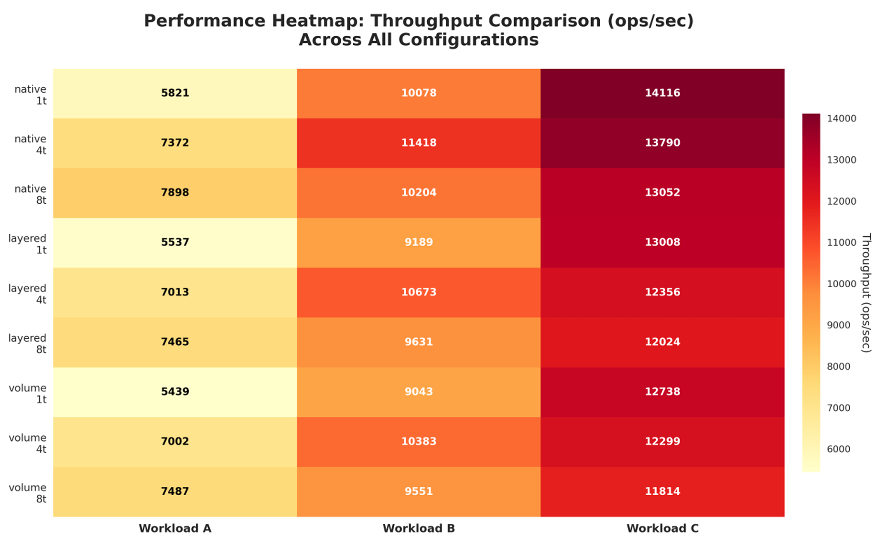
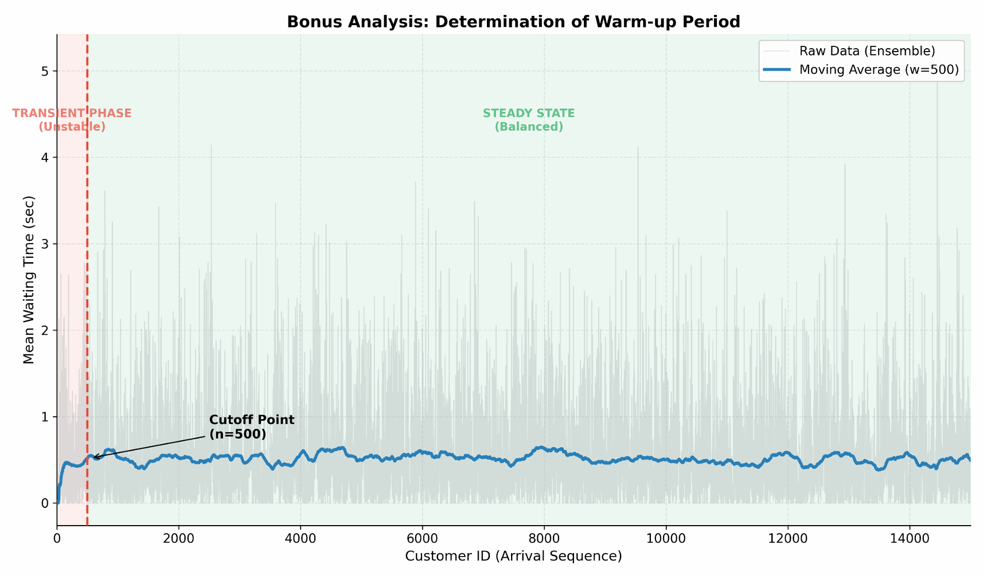

# Systems Simulation & Performance Modeling 📊🚀

A repository containing two advanced projects on **System Performance Analysis** and **Discrete Event Simulation (DES)**.
Developed for the *Simulation and Modeling of Computer Systems* course at the **University of Ioannina**.


-green)


## 📂 Project 1: Database Performance in Virtualized Environments

An automated benchmarking study of **MariaDB** running inside **Docker Containers**, comparing different storage drivers.

### 🎯 Objective
To analyze the overhead of virtualization on database performance (Throughput & Latency) under heavy workloads.

### 🛠️ Methodology
* **Benchmarks:** Used **YCSB (Yahoo! Cloud Serving Benchmark)** to generate Workloads A (Update heavy), B (Read heavy), and C (Read only).
* **Scenarios:**
    1.  **Native:** Running directly on the Host OS.
    2.  **Layered:** Docker Container using the Copy-on-Write (CoW) driver.
    3.  **Volume:** Docker Container using mounted Data Volumes.
* **Automation:** Developed a Python script (`autorun_experiments.py`) to orchestrate container lifecycle, execute YCSB, and parse results automatically.

### 📊 Key Findings
* Docker Volumes perform almost identically to Native execution (negligible overhead).
* Layered storage introduces significant latency during write-intensive operations (Workload A).

### 📸 Results


---

## 🎲 Project 2: Simulation of Heterogeneous Clusters

A Discrete Event Simulation (DES) of a load balancing system with 12 heterogeneous servers, implemented using the **Ciw** library.

### 🎯 Objective
To evaluate load balancing algorithms (Round Robin vs. SQ(d)) on a cluster with "Fast", "Medium", and "Slow" worker nodes.

### ⚙️ Implementation Details
* **System:** A Dispatcher node routing jobs to 11 Worker nodes with different exponential service rates.
* **Algorithms:**
    * *Algo 1:* Probabilistic Routing (Random/Round Robin).
    * *Algo 2:* Shortest Queue choice among d randomly selected nodes (SQ(d)).
* **Statistical Rigor:**
    * Calculated **95% Confidence Intervals** for all metrics.
    * Performed **Transient Analysis** to detect the system's warm-up period.
    * Validated the "Power of Two Choices" (d=2) principle.

### 🐍 Code Structure
* `simulation.py`: Core logic defining the Network, Distributions, and Ciw execution.
* `run_experiments.py`: Automates runs for different d parameters (d=1 to d=5).
* `bonus_analysis.py`: Performs moving average analysis to visualize system stability.

### 📸 Simulation Results


---

## 🚀 How to Run

### Lab 1 (DB Benchmarks)
* **Prerequisites:** Docker, YCSB installed, Python 3.
* **Configuration:** Update the paths (`YCSB_HOME`, `RESULTS_DIR`) in `autorun_experiments.py`.
* **Run:**
    ```bash
    sudo python autorun_experiments.py
    ```

### Lab 2 (Cluster Simulation)
1.  Install dependencies:
    ```bash
    pip install -r requirements.txt
    ```
2.  Run the main simulation loop:
    ```bash
    python run_experiments.py
    ```
3.  Run the transient analysis:
    ```bash
    python bonus_analysis.py
    ```

## 📄 Reports
For full mathematical analysis and experimental data:
* [Database Performance Report](Lab1-Database-Performance/reports/Docker_Storage_Performance_Report.pdf)
* [Cluster Simulation Report](Lab2-Cluster-Simulation/reports/Heterogeneous_Cluster_Simulation_Report.pdf)

## 👨‍💻 Author
**Panagiotis Paraskevopoulos**
*Student, Dept. of Computer Science & Engineering, UOI*